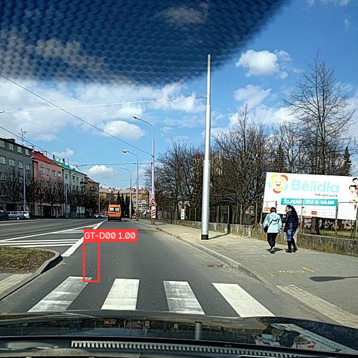
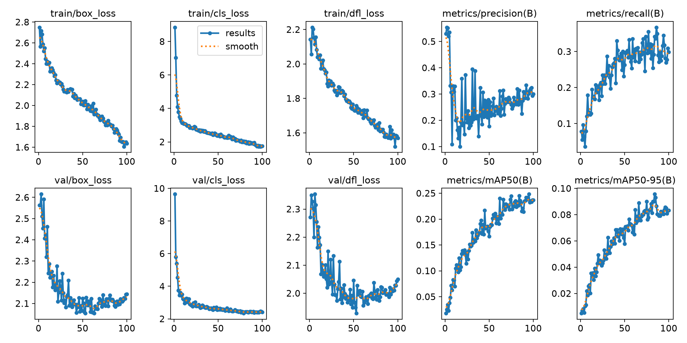
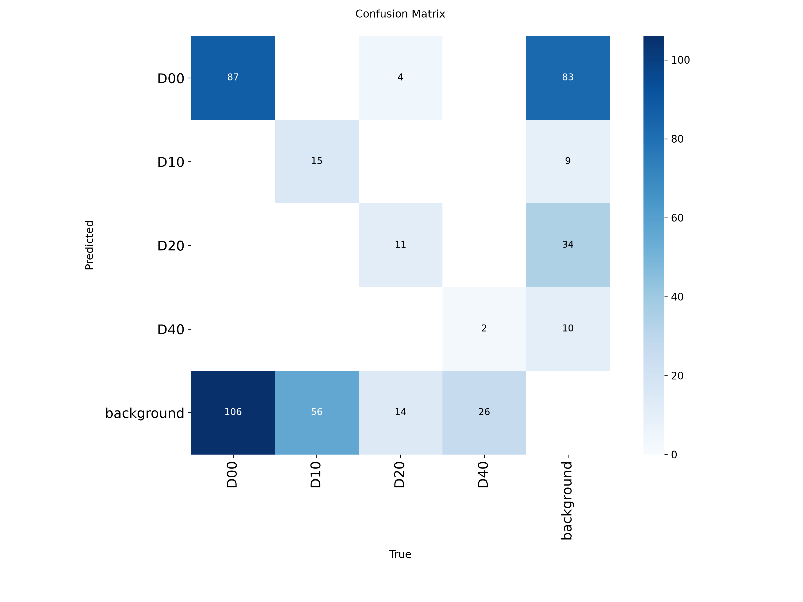
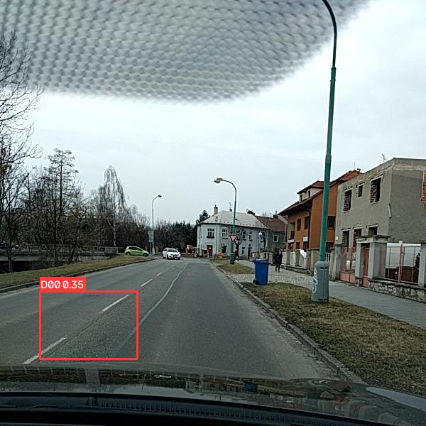
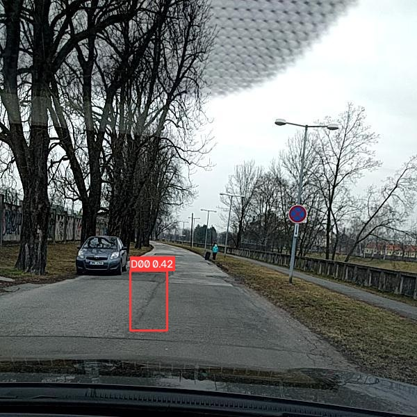
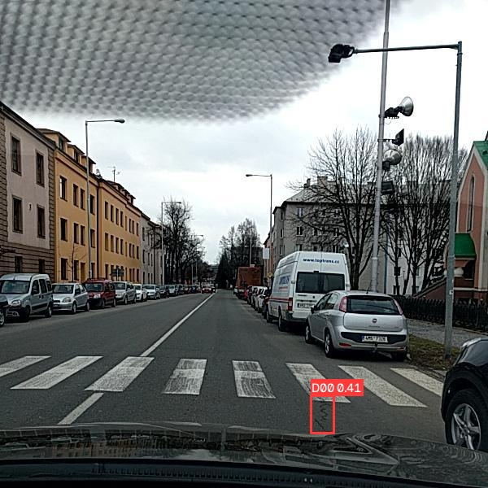

# Road Damage Detection

> **Status:** ✅ Baseline completed. The full pipeline — data preparation → training → evaluation → inference → FastAPI API → ONNX export and verification → latency/FPS benchmarking — is implemented and tested. A YOLOv8n baseline was trained for 100 epochs on the RDD2022 Czech subset, with measured validation metrics and prediction samples reported below.

## Project Summary

**Road Damage Detection** is an end-to-end computer-vision pipeline that detects and classifies road-surface damage — longitudinal cracks, transverse cracks, alligator cracks, and potholes — from street-level images using **YOLOv8**.

The project covers the complete workflow: **RDD2022** dataset preparation, Pascal VOC XML to YOLO TXT conversion, configuration-driven training and evaluation, CLI inference, FastAPI inference API, ONNX export tooling, and FPS / latency benchmarking tooling for edge-oriented deployment.

## Project Overview

Road infrastructure inspection is usually expensive, slow, and manual. This project explores how deep learning can be used to automatically detect visible road damage from camera images.

The project focuses on four common road damage classes from the RDD2022 dataset:

| ID | Code | Meaning |
|---:|:-----|:--------|
| 0 | D00 | Longitudinal crack |
| 1 | D10 | Transverse crack |
| 2 | D20 | Alligator crack |
| 3 | D40 | Pothole |

## Features

- YOLOv8-based road damage detection
- RDD2022 dataset support
- Pascal VOC XML to YOLO TXT annotation conversion
- Automatic train / validation split
- Dataset analysis and class-distribution reporting
- Ground-truth label visualization
- Config-driven training and inference
- CLI tools for training, evaluation, and inference
- FastAPI inference service
- ONNX export tooling
- FPS / latency benchmark tooling
- Unit tests with pytest
- GitHub Actions CI workflow
- Docker support

## Repository Structure

```text
road-damage-detection/
├── .github/
│   └── workflows/
│       └── ci.yml
├── assets/
│   ├── dataset_analysis/
│   ├── evaluation/
│   ├── ground_truth_samples/
│   ├── predictions/
│   └── training/
├── configs/
│   ├── config.yaml
│   ├── config_smoke.yaml
│   └── config_train.yaml
├── data/
│   └── .gitkeep
├── models/
│   └── .gitkeep
├── notebooks/
│   └── .gitkeep
├── outputs/
│   └── .gitkeep
├── scripts/
│   ├── analyze_dataset.py
│   ├── download_data.py
│   ├── generate_prediction_samples.py
│   ├── prepare_dataset.py
│   └── visualize_yolo_labels.py
├── src/
│   └── road_damage/
│       ├── __init__.py
│       ├── api.py
│       ├── benchmark.py
│       ├── config.py
│       ├── dataset.py
│       ├── detection.py
│       ├── evaluate.py
│       ├── export_onnx.py
│       ├── inference.py
│       ├── model.py
│       ├── train.py
│       ├── visualize.py
│       └── utils/
│           ├── __init__.py
│           ├── io.py
│           └── logging.py
├── tests/
├── Dockerfile
├── pyproject.toml
├── requirements.txt
├── requirements-dev.txt
└── README.md
```

## Dataset

This project uses the **RDD2022** road damage dataset.

The original annotations are provided in Pascal VOC XML format. The script `scripts/prepare_dataset.py` converts these XML annotations into YOLO TXT labels and creates a train / validation split.

Dataset source repository:

```text
https://github.com/sekilab/RoadDamageDetector
```

For the first baseline, I used the **RDD2022 Czech subset**.

Expected raw dataset layout before conversion:

```text
data/raw/Czech/
├── annotations/
│   └── xmls/
│       ├── Czech_000001.xml
│       └── ...
└── images/
    ├── Czech_000001.jpg
    └── ...
```

Expected prepared dataset layout after conversion:

```text
data/rdd2022/
├── images/
│   ├── train/
│   └── val/
├── labels/
│   ├── train/
│   └── val/
└── data.yaml
```

Large datasets, training runs, model checkpoints, and generated outputs are ignored by Git and should not be committed directly.

## Setup

Create and activate a virtual environment:

```bash
python -m venv .venv
```

On Windows:

```bash
.venv\Scripts\activate
```

On Linux / macOS:

```bash
source .venv/bin/activate
```

Install dependencies:

```bash
python -m pip install --upgrade pip
pip install -r requirements.txt
pip install -e .
```

For development and testing:

```bash
pip install -r requirements-dev.txt
```

## GPU Setup

The baseline was trained locally with CUDA-enabled PyTorch on an NVIDIA GPU.

Example CUDA check:

```bash
python -c "import torch; print(torch.__version__); print('CUDA available:', torch.cuda.is_available()); print('Torch CUDA:', torch.version.cuda); print('Device:', torch.cuda.get_device_name(0) if torch.cuda.is_available() else 'CPU only')"
```

Baseline device used:

```text
NVIDIA GeForce RTX 5070 Laptop GPU
```

## Configuration

The project is controlled through YAML configuration files in:

```text
configs/
```

Main configuration files:

| File | Purpose |
|---|---|
| `configs/config.yaml` | Default project configuration |
| `configs/config_smoke.yaml` | One-epoch smoke training configuration |
| `configs/config_train.yaml` | Baseline training configuration |

Important configuration sections:

- `data`: dataset paths and class names
- `model`: pretrained weights and trained checkpoint path
- `train`: training hyperparameters
- `inference`: confidence threshold, IoU threshold, image size, and device
- `api`: FastAPI host, port, and upload size limit

Example:

```yaml
model:
  weights: yolov8n.pt
  checkpoint: models/best.pt

inference:
  conf: 0.25
  iou: 0.45
  imgsz: 640
  device: 0
```

## Data Preparation

Convert RDD2022 Pascal VOC XML annotations to YOLO format:

Windows:

```bash
python scripts/prepare_dataset.py ^
    --src data/raw/Czech ^
    --dst data/rdd2022 ^
    --val-ratio 0.2 ^
    --seed 42
```

Linux / macOS:

```bash
python scripts/prepare_dataset.py \
    --src data/raw/Czech \
    --dst data/rdd2022 \
    --val-ratio 0.2 \
    --seed 42
```

The script creates:

```text
data/rdd2022/images/train
data/rdd2022/images/val
data/rdd2022/labels/train
data/rdd2022/labels/val
```

The YOLO dataset descriptor `data.yaml` is generated automatically by the project utilities.

Generate or verify `data.yaml`:

```bash
python -c "from road_damage.config import Config; from road_damage.dataset import build_data_yaml; cfg=Config.load('configs/config.yaml'); print(build_data_yaml(cfg))"
```

## Dataset Analysis

I prepared the **RDD2022 Czech subset** and converted the original Pascal VOC XML annotations into YOLO TXT labels.

After conversion, the dataset contains:

| Split | Images | Label files | Empty label files |
|---|---:|---:|---:|
| Train | 2264 | 2264 | 1403 |
| Validation | 565 | 565 | 354 |

Empty label files are valid in YOLO training. They represent road images where no target damage class is annotated, so the model also sees background / no-damage examples.

### Object Count per Class

| Class | Meaning | Count |
|---|---|---:|
| D00 | Longitudinal crack | 988 |
| D10 | Transverse crack | 399 |
| D20 | Alligator crack | 161 |
| D40 | Pothole | 197 |

The class distribution is imbalanced. Longitudinal cracks (**D00**) are the most common, while alligator cracks (**D20**) and potholes (**D40**) are much less frequent. This imbalance is important when interpreting per-class performance.

The generated dataset summary is saved in:

```text
assets/dataset_analysis/dataset_summary.md
```

## Dataset Label Verification

Before training, I verified the converted YOLO labels by drawing the ground-truth bounding boxes on real validation images from the RDD2022 Czech subset.

This step confirms that the Pascal VOC XML to YOLO TXT conversion works correctly and that the bounding boxes align with visible road cracks and potholes.

Example ground-truth visualization:



More samples are available in:

```text
assets/ground_truth_samples/
```

## Training

Train using the default configuration:

```bash
rdd-train --config configs/config.yaml
```

Run a one-epoch smoke test:

```bash
rdd-train --config configs/config_smoke.yaml
```

Run the baseline training configuration:

```bash
rdd-train --config configs/config_train.yaml
```

Baseline training setup:

| Item | Value |
|---|---|
| Model | YOLOv8n |
| Dataset | RDD2022 Czech subset |
| Train images | 2264 |
| Validation images | 565 |
| Epochs | 100 |
| Image size | 640 |
| Batch size | 8 |
| Device | NVIDIA GeForce RTX 5070 Laptop GPU |

Training outputs are saved under:

```text
runs/
```

After training, the best checkpoint is copied locally to:

```text
models/best.pt
```

The model checkpoint is distributed through the repository's `v0.1.0` GitHub Release rather than committed directly to Git.

## Evaluation

Evaluate the trained model on the validation split:

```bash
rdd-eval --config configs/config_train.yaml --split val
```

Raw evaluation output is stored in:

```text
assets/evaluation/eval_output.txt
```
## Model Release

The trained YOLOv8n PyTorch checkpoint and the exported ONNX model are available in the GitHub Release below.

Release:

```text
v0.1.0 — YOLOv8n baseline (RDD2022 Czech)
```

Download files:

- `best.pt` — trained YOLOv8n PyTorch checkpoint
- `road_damage_640.onnx` — exported ONNX model with static 640×640 input size

Release page:

```text
https://github.com/Tamer1020/road-damage-detection/releases/tag/v0.1.0
```

The model files are not committed directly to Git because binary model weights are ignored by `.gitignore`.

## Baseline Training Results

I trained a **YOLOv8n** baseline on the **RDD2022 Czech subset** for **100 epochs** on a local NVIDIA GPU.

These are measured results from the actual validation run.

### Validation Metrics

| Metric | Value |
|---|---:|
| Precision | 0.315 |
| Recall | 0.340 |
| mAP@50 | 0.245 |
| mAP@50-95 | 0.0954 |

### Per-Class Metrics

| Class | Description | Precision | Recall | mAP@50 | mAP@50-95 |
|---|---|---:|---:|---:|---:|
| D00 | Longitudinal crack | 0.408 | 0.456 | 0.417 | 0.171 |
| D10 | Transverse crack | 0.415 | 0.296 | 0.248 | 0.0759 |
| D20 | Alligator crack | 0.208 | 0.448 | 0.238 | 0.104 |
| D40 | Pothole | 0.231 | 0.162 | 0.0752 | 0.0303 |

These are first baseline results from a YOLOv8n model trained on the RDD2022 Czech subset. The results are reported as measured, without artificial tuning or fake metrics.

## Training Artifacts

Training curves, confusion matrices, and training logs are stored in:

```text
assets/training/
```

Main artifacts:

- `results.png`
- `results.csv`
- `confusion_matrix.png`
- `confusion_matrix_normalized.png`
- `BoxPR_curve.png`
- `BoxP_curve.png`
- `BoxR_curve.png`
- `BoxF1_curve.png`
- `args.yaml`

Training curves:



Confusion matrix:



## Inference CLI

Run inference on one image:

```bash
rdd-infer --config configs/config_train.yaml --image path/to/street.jpg --save
```

The command prints detections as JSON and optionally saves an annotated image to:

```text
outputs/
```

Example output format:

```json
[
  {
    "class_id": 0,
    "label": "D00",
    "confidence": 0.87,
    "bbox": [120.5, 85.0, 310.2, 160.8]
  }
]
```

## Sample Predictions

Sample predictions were generated on validation images from the RDD2022 Czech subset using the trained YOLOv8n baseline.







More prediction samples are available in:

```text
assets/predictions/
```

Prediction summary:

```text
assets/predictions/prediction_summary.md
```

## Inference API

Start the FastAPI server:

```bash
rdd-serve
```

Alternative:

```bash
uvicorn road_damage.api:app --host 0.0.0.0 --port 8000
```

Health check:

```bash
curl http://127.0.0.1:8000/health
```

Expected response:

```json
{"status":"ok"}
```

Prediction endpoint:

```text
POST /predict
```

Example request:

```bash
curl -s -F "file=@street.jpg" "http://127.0.0.1:8000/predict?annotate=false"
```

Use `annotate=true` to return a base64 encoded annotated image.

## Deployment: ONNX Export & Inference Benchmark

After training, the YOLOv8n checkpoint was exported to **ONNX** with a fixed 640×640 input size.

The goal of this step is to verify that the model can run outside the PyTorch training environment and to measure real inference latency across different backends.

The exported ONNX model is stored locally as:

```text
models/road_damage_640.onnx
```

The ONNX model file is not committed directly to Git because model binaries are ignored. The exported model is available in the repository's `v0.1.0` GitHub Release.

### ONNX Export

Export command:

```bash
rdd-export-onnx --config configs/config_train.yaml --output models/road_damage_640.onnx --imgsz 640
```

Export result:

| Item | Value |
|---|---:|
| ONNX model size | 11.7 MB |
| Input size | 640×640 |
| Export type | Static input size |

A static input size was used because the inference pipeline is designed around a fixed deployment resolution. This is common in edge and real-time systems, where predictable latency is often more important than dynamic input flexibility.

### ONNX Runtime Verification

The exported ONNX model was verified with **ONNX Runtime** and compared against the original PyTorch checkpoint on the same validation image.

Verification command:

```bash
python scripts/verify_onnx.py --config configs/config_train.yaml --pt models/best.pt --onnx models/road_damage_640.onnx --image data/rdd2022/images/val/Czech_000047.jpg
```

Verification result:

| Check | Result |
|---|---:|
| ONNX Runtime session created | ✅ Yes |
| PyTorch detections | 1 |
| ONNX detections | 1 |
| Class labels match | ✅ True |
| Max confidence delta | 0.000000 |
| Max box coordinate difference | 0.0000 px |

This confirms that the ONNX export preserves the PyTorch model output for the tested image.

Raw verification log:

```text
assets/evaluation/onnx_verification.txt
```

### Latency / Throughput Benchmark

Inference speed was measured with `rdd-benchmark` on a fixed set of 10 validation images.

Benchmark setup:

| Item | Value |
|---|---|
| Images | 10 validation images |
| Input size | 640×640 |
| Confidence threshold | 0.25 |
| IoU threshold | 0.45 |
| Warmup runs | 10 |
| Timed runs | 100 |
| Image decoding | Excluded from timing |

Hardware:

| Component | Value |
|---|---|
| CPU | 13th Gen Intel(R) Core(TM) i7-13650HX |
| GPU | NVIDIA GeForce RTX 5070 Laptop GPU |
| RAM | 31.7 GB |
| OS / Machine | Windows AMD64 |

Benchmark results:

| Backend | Device | Mean latency | p95 latency | FPS |
|---|---|---:|---:|---:|
| PyTorch | RTX 5070 Laptop GPU | 7.632 ms | 8.938 ms | 131.02 |
| PyTorch | CPU | 59.187 ms | 69.414 ms | 16.90 |
| ONNX Runtime | CPU | 21.466 ms | 22.870 ms | 46.59 |

The ONNX Runtime CPU backend is approximately **2.76× faster** than PyTorch CPU on this benchmark:

```text
59.187 ms / 21.466 ms ≈ 2.76×
```

Raw benchmark files:

```text
assets/evaluation/benchmark_pt_gpu.json
assets/evaluation/benchmark_pt_cpu.json
assets/evaluation/benchmark_onnx_cpu.json
```

### Why This Matters

For road damage detection, deployment speed matters because a real system may run on vehicle-mounted cameras, roadside devices, or embedded hardware.

This benchmark shows three important points:

- the PyTorch GPU version is fast enough for real-time inference on a strong NVIDIA GPU
- PyTorch CPU inference is much slower
- ONNX Runtime significantly improves CPU inference speed compared with PyTorch CPU

This supports the edge-oriented direction of the project: a small YOLOv8n model, ONNX export, and measured latency instead of assumed performance.

## Why Edge AI Matters

For road damage detection, accuracy is not the only important factor. A model may also need to run in real time on limited hardware, such as:

- vehicle-mounted cameras
- industrial edge devices
- roadside inspection systems
- embedded GPU platforms
- CPU-only gateways

That is why this project includes ONNX export and FPS benchmarking tools. These tools make it possible to compare model speed, latency, and deployment readiness.

## Docker

Build the Docker image:

```bash
docker build -t road-damage-detection .
```

Run the API container:

```bash
docker run --rm -p 8000:8000 -v "$(pwd)/models:/app/models" road-damage-detection
```

The Docker image runs the API as a non-root user and includes a health check.

## Testing

Run the test suite:

```bash
pytest -q
```

Run linting:

```bash
ruff check src tests scripts
```

Current test coverage includes:

- config loading
- dataset YAML generation
- image encoding / decoding
- visualization utilities

Expected result:

```text
9 passed
```

## Current Status

| Component | Status |
|---|---|
| Dataset pipeline (VOC → YOLO conversion + train/val split) | ✅ Implemented |
| Dataset analysis | ✅ Completed |
| Ground-truth label visualization | ✅ Completed |
| Config-driven training (`rdd-train`) | ✅ Implemented |
| YOLOv8n baseline training | ✅ Completed |
| Evaluation (`rdd-eval`, mAP@50 / mAP@50-95) | ✅ Completed |
| Sample prediction generation | ✅ Completed |
| Inference — CLI (`rdd-infer`) | ✅ Implemented |
| Inference — FastAPI API (`/health`, `/predict`) | ✅ Implemented |
| ONNX export (`rdd-export-onnx`) | ✅ Implemented |
| FPS / latency benchmark tool (`rdd-benchmark`) | ✅ Implemented |
| Unit tests + CI | ✅ 9 tests passing |
| Docker image (non-root, healthcheck) | ✅ Implemented |
| ONNX Runtime verification | ✅ Completed |
| Measured FPS / latency benchmark | ✅ Completed |
| GitHub Release for trained checkpoint and ONNX model | ✅ Published (`v0.1.0`) |

## Discussion

The first baseline shows that the model learns the most frequent damage class (**D00**) better than the rarer classes. This is expected because the Czech subset is imbalanced: D00 has many more annotations than D20 and D40.

The pothole class (**D40**) has the weakest performance in this baseline. A likely reason is the low number of pothole annotations compared with longitudinal cracks. Future improvements should focus on more training data, comparing YOLOv8n with YOLOv8s, stronger augmentation, and checking per-class failure cases visually.

## What I Learned

This project demonstrates practical experience with:

- object detection using YOLO
- road damage detection datasets
- annotation format conversion
- Pascal VOC XML parsing
- YOLO TXT label generation
- model training and evaluation
- inference visualization with OpenCV
- API deployment with FastAPI
- ONNX model export
- FPS and latency benchmarking
- Python package structure
- unit testing
- Docker-based deployment

## Limitations

Current limitations:

- The first trained model is a baseline, not an optimized final model.
- The repository does not include the full RDD2022 dataset because it is too large.
- The class distribution is imbalanced, especially for D20 and D40.
- Benchmark results depend strongly on the hardware.
- The first version focuses on bounding-box detection only.
- INT8 quantization and TensorRT deployment are not implemented yet.

## Roadmap / Next Steps

- [x] Prepare RDD2022 Czech subset
- [x] Convert Pascal VOC XML annotations to YOLO labels
- [x] Verify ground-truth labels visually
- [x] Analyze dataset image counts and class distribution
- [x] Train YOLOv8n baseline for 100 epochs
- [x] Add measured evaluation metrics
- [x] Add sample prediction images
- [x] Add training curves and confusion matrix
- [x] Export trained model to ONNX and verify it with ONNX Runtime
- [x] Add measured latency / FPS from `rdd-benchmark`, with the test device stated
- [ ] Add a short demo GIF or video of the FastAPI `/predict` endpoint
- [ ] Compare YOLOv8n with YOLOv8s
- [ ] Investigate class imbalance and per-class failure cases

## License

MIT — see `LICENSE`.