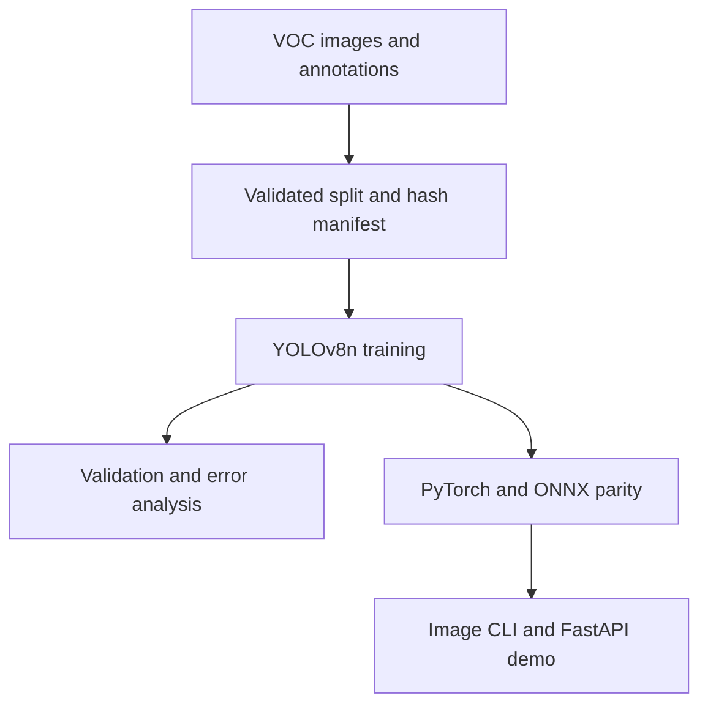

# Road Damage Detection

**YOLOv8n road inspection — from validated data preparation to FastAPI inference and verified ONNX export.**

[](https://github.com/Tamer1020/road-damage-detection/actions/workflows/ci.yml)
[](https://github.com/Tamer1020/road-damage-detection/releases/tag/v0.1.0)

[Watch demo](#60-second-demo) · [Try it locally](#quickstart) · [Model card](docs/MODEL_CARD.md) · [Error analysis](docs/ERROR_ANALYSIS.md) · [Reproduce](docs/REPRODUCTION.md)

Detect longitudinal cracks, transverse cracks, alligator cracks and potholes in street-level images. This project demonstrates the full engineering workflow: annotation conversion, model training, evaluation, a usable inference service, export verification and measured backend performance.

## 60-second demo

https://github.com/user-attachments/assets/643673e6-527c-4384-85cd-e24cadd2915a

[Download MP4](assets/demo/road-damage-demo.mp4) · [Captions](assets/demo/road-damage-demo.srt)

The video replays **real HTTP responses** from the released model and shows both a detected crack and missed/misclassified damage. Chapter timing is edited for readability; it is not a throughput demonstration. [Inputs, capture evidence and reproduction](docs/DEMO.md).

## Results at a glance

| Evidence | Result | Scope |
|---|---|---|
| Detection quality | **mAP@50 24.5% · mAP@50–95 9.54%** | Historical YOLOv8n validation run: 565 images, RDD2022 Czech subset |
| CPU inference | **46.59 images/s · 21.466 ms mean · 22.870 ms p95** | Historical ONNX Runtime benchmark on an i7-13650HX; image decoding excluded |
| Backend comparison | **2.76× lower mean latency** for ONNX vs PyTorch CPU | Same reported 10-image benchmark; 10 warmups, 100 timed calls |
| Export parity | **10 benchmark images + 4 demo fixtures pass** | Same-class, one-to-one post-NMS matching; IoU ≥ 0.99, confidence delta ≤ 0.0001, box delta ≤ 0.1 px |
| Software checks | **62 unit/contract tests**, plus real-weight smoke checks | Preparation, parity matching, image handling and HTTP behavior; CI details below |

**These results have different scopes.** Export parity checks implementation consistency, not detection accuracy. The demo fixtures include a resized version of one benchmark scene; they are not 14 independent validation scenes. CPU numbers are from a laptop-class processor, not a Jetson or another embedded target. [Raw evidence and methodology](docs/MODEL_CARD.md).

The baseline misses substantial damage: overall reported recall is **34.0%**, and pothole recall is **16.2%**. No detections does not establish that a road is damage-free.

## What is implemented

- **Data integrity:** VOC → YOLO conversion with box validation, reproducible splitting, input/label SHA-256 manifests and exact duplicate checks across splits. Preparation refuses a non-empty destination, preventing stale files from contaminating a new split.
- **Training and evaluation:** configuration-driven YOLOv8 training, per-class validation metrics, logs, learning curves and published weights.
- **Inference:** image CLI, FastAPI `/predict`, a browser demo at `/demo`, separate `/health` and `/ready`, bounded upload reads, pixel limits and serialized access to the shared predictor.
- **Deployment verification:** ONNX export, multi-image parity checks that fail on mismatches, and latency/throughput benchmarking.
- **Reproducibility:** checksummed model downloads, captured API responses, tests, CI and documented experiment boundaries.

## Quickstart

The CPU setup below was tested on Linux with Python 3.12. Run commands from the repository root.

```bash
git clone https://github.com/Tamer1020/road-damage-detection.git
cd road-damage-detection
python -m venv .venv
```

Activate with `source .venv/bin/activate` on Linux, or `.venv\Scripts\activate` on Windows.

```bash
# CPU wheels; GPU installation instructions are in docs/REPRODUCTION.md.
python -m pip install torch==2.11.0 torchvision==0.26.0 --index-url https://download.pytorch.org/whl/cpu
python -m pip install -e . -c constraints-cpu.txt
python scripts/download_models.py

# A bundled road image: no full dataset download needed.
rdd-infer --config configs/config.yaml --image assets/demo/inputs/Czech_000047.jpg --save
rdd-serve
```

Open **http://127.0.0.1:8000/demo** to upload a JPEG/PNG and inspect boxes, confidence scores and JSON. API documentation is at **http://127.0.0.1:8000/docs**. `inference_ms` measures the model call; it excludes upload, decoding, queueing and annotation.

```bash
curl http://127.0.0.1:8000/ready
curl -F "file=@assets/demo/inputs/Czech_000047.jpg" "http://127.0.0.1:8000/predict?annotate=false"
```

The model downloader retrieves `best.pt` and `road_damage_640.onnx` from [release v0.1.0](https://github.com/Tamer1020/road-damage-detection/releases/tag/v0.1.0), verifies SHA-256 and refuses to overwrite different local weights.

## Check the export yourself

```bash
rdd-verify-onnx --config configs/config.yaml --pt models/best.pt --onnx models/road_damage_640.onnx --folder assets/demo/inputs --output outputs/parity.json
```

Both backends use CPU, confidence 0.25, NMS IoU 0.45 and fixed 640×640 preprocessing for this check. Matching is independent of confidence rank. Exit codes: **0** pass, **1** mismatch or insufficient non-empty cases, **2** invalid input/execution error. An all-empty run is inconclusive.

Reports: [10 original benchmark images](assets/evaluation/onnx_parity_benchmark_images.json) · [4 demo fixtures](assets/evaluation/onnx_parity_demo_images.json). These checks use the published weights; they do not retrain or replace the historical accuracy evaluation.

## Architecture



The `Detection` type keeps inference output separate from framework-specific objects. The current ONNX path still uses the Ultralytics wrapper and its Python dependencies; a standalone lightweight runtime is future work.

## Development and CI

```bash
python -m pip install -r requirements-test.txt
python -m pip install --no-deps -e .
pytest -q
ruff check src tests scripts
```

The unit/contract suite runs without downloading weights or importing the training stack, using an injected predictor for API tests. CI tests Python 3.10, 3.11 and 3.12. A separate CPU integration job downloads the release with checksum verification and exercises the real models and HTTP API.

For dataset preparation, training, GPU setup, Docker and benchmark commands, see the [reproduction guide](docs/REPRODUCTION.md).

## Validation boundaries and next experiments

**Measured:** one Czech-subset baseline, published validation artifacts, laptop CPU/GPU inference benchmarks, scoped ONNX parity checks and real local API responses.

**Not established:** performance on an independent country/route split, near-duplicate-free separation of historical driving sequences, production API load behavior, detection of every road defect, or latency/power consumption on an embedded device. The current data checks prevent exact duplicates and stale split files; they do not detect visually similar neighboring frames.

**Next experiments:** analyze the rare D20/D40 failures; compare YOLOv8n/YOLOv8s on a fixed split; evaluate cross-country generalization; then measure a standalone ONNX runtime and quantization on named target hardware. Camera-quality gating with [Road Camera Health Monitor](https://github.com/Tamer1020/road-camera-health-monitor) is a proposed integration, not an implemented feature here.

## Data and attribution

Dataset: [RDD2022 / CRDDC](https://github.com/sekilab/RoadDamageDetector), [dataset record](https://doi.org/10.6084/m9.figshare.21431547.v1). The original benchmark/visualization assets are retained. Four additional demo inputs are 640×640 copies retrieved from a public dataset mirror; exact source URLs and hashes are in [input provenance](assets/demo/input-provenance.json). They do not replace the historical validation data. [Third-party notices](docs/ATTRIBUTION.md).

Project code: MIT — see [LICENSE](LICENSE). Dataset and third-party model/software terms remain separate.
