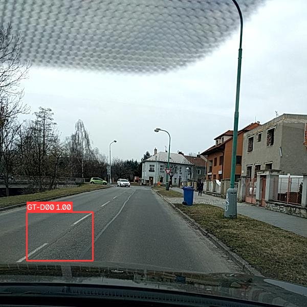
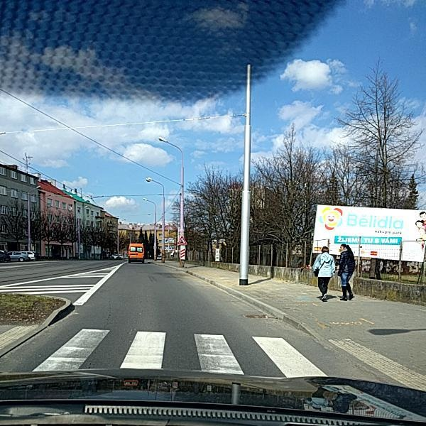
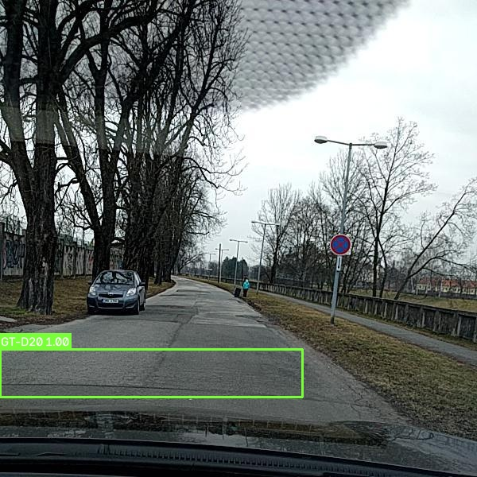

# Error analysis

This is a qualitative review of named examples, not a new accuracy estimate. Historical ground-truth and prediction images remain unchanged. The new API examples use the same released weights; where a resized input is used, it is explicitly identified.

## 1. A detected longitudinal crack — Czech_000047

| Published ground truth | Published prediction |
|---|---|
|  |  |

The prediction recovers the annotated D00 region qualitatively. This is a useful demonstration, not evidence that other cracks are reliably detected. The new API replay uses a separately sourced 640×640 version of this scene, so its score and coordinates can differ from this historical 600×600 artifact. [Captured response](../assets/demo/capture/crack.json).

## 2. Missing an annotated crack — Czech_000006

| Published ground truth | Current API response on the original benchmark image |
|---|---|
|  |  |

The reference marks a D00 crack near the crossing; the real API call returns an empty detection list at confidence 0.25. A thin/distant crack is a candidate difficulty to investigate, not an established causal explanation. [Input](../assets/bench_images/Czech_000006.jpg) · [Captured response](../assets/demo/capture/missed_damage.json).

## 3. An annotated D20 region is not recovered — Czech_000113

| Published ground truth | Published prediction |
|---|---|
|  |  |

The reference contains a wide D20 region; the model reports D00 in a smaller region. Producing a box is not the same as recovering the annotated class and extent. The existing artifacts support this qualitative comparison; no IoU or new per-class score is inferred from rendered screenshots. The API replay on the 640×640 demo copy also reports D00. [Captured response](../assets/demo/capture/class_confusion.json).

## Selection bias and interpretation

The historical sample generator deliberately chose images containing ground-truth objects **and** at least one prediction. That gallery omitted missed-detection-only cases and background images, so it should not be treated as a representative accuracy sample. The new demo includes a missed-detection case explicitly.

The original ground-truth overlays display `1.00` because the drawing helper used a unit confidence value for annotations. It is not a measured model score.

## Controlled next experiments

1. Keep an immutable split manifest and define a separate test protocol before tuning thresholds.
2. Export per-image predictions and ground-truth labels on the full validation split. Match with declared IoU/confidence thresholds to count false positives, misses and class confusion.
3. Review D40 and D20, plus hard negative road markings, repaired asphalt, shadows and small/distant cracks. Their actual failure rates remain to be measured.
4. Compare YOLOv8n and YOLOv8s with the same split and training budget; report per-class accuracy alongside latency on the same device.
5. Evaluate a country/route holdout before describing results as robust to new environments.

Changing class sampling, augmentation, image size or architecture may help, but no improvement is claimed without a measured comparison.
